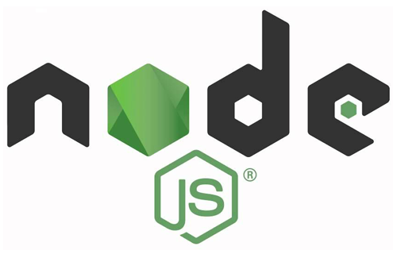

# Squora

[Squora](https://squora.herokuapp.com/), a full-stack application inspired by the questions and answers website Quora, is an online platform for users to ask questions and share answers related to stock markets and investing.

Visit the [wiki](https://github.com/w-duffy/squora/wiki/Feature-List) for more information.

## Live Link
[Squora](https://squora.herokuapp.com/)

## Installation
**Prerequisites**
 - Node.js
 - NPM
 - PostgreSQL

**Getting Started**


- Clone the repository from Github
   ```bash
   git clone https://github.com/w-duffy/squora.git
   ```
- Install NPM packages in /frontend folder
   ```bash
   npm install
   ```
- Install NPM packages in /backend folder
   ```bash
   npm install
   ```
- Create a **.env** file based on the example with proper settings for your
   development environment

- Setup your PostgreSQL user, password and database and make sure it matches your **.env** file

- Migrate your database, seed your database, and run your express app from your backend and frontend folders

   ```bash
   npx dotenv sequelize-cli db:migrate
   ```

   ```bash
   npx dotenv sequelize-cli db:seed:all

   ```

   ```bash
    npm start
   ```


## Technologies


-  JavaScript
-  CSS

-  Node.js
-  Express
-  PostgreSQL
-  Sequelize
-  React
-  Redux


## Contact

Email: w.duffy@outlook.com

Linkedin: [My Linkedin](https://www.linkedin.com/in/will-duffy-a46a7a8a/)

Project Link: [Project GitHub Link](https://github.com/w-duffy/squora)
